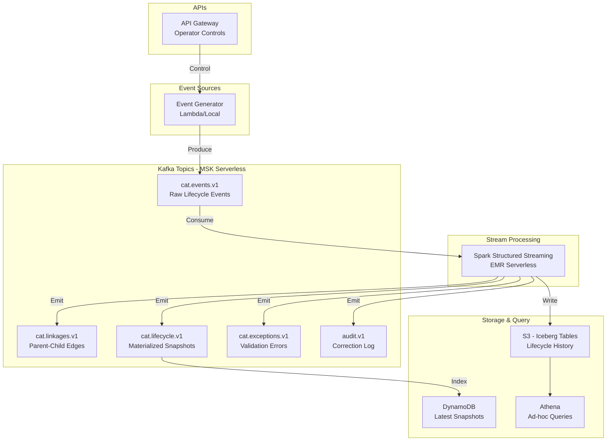

# Simplified Consolidated Audit Trail (CAT) - Educational Implementation

[](https://opensource.org/licenses/MIT)

> **Educational Project for UNC Charlotte Graduate CS Students**  
> Cloud & Distributed Systems Course - Streaming Event Sourcing & Lifecycle Reconstruction

## What is This?

This repository implements a **simplified, educational version** of a Consolidated Audit Trail (CAT) system using modern streaming architecture. It demonstrates how to reconstruct complete order lifecycles across distributed broker and venue systems using event sourcing, Apache Kafka, and Apache Spark Structured Streaming.

### Real-World Context

The SEC's [Rule 613](https://www.sec.gov/about/divisions-offices/division-trading-markets/rule-613-consolidated-audit-trail) requires a consolidated audit trail that captures the lifecycle of orders across the U.S. securities markets. This system teaches the distributed systems concepts behind such regulatory infrastructure.

## 🎯 Learning Objectives

Students will learn:
- Event sourcing and immutable audit trails
- Streaming data processing with event-time semantics
- Handling late-arriving and out-of-order events
- Idempotency in distributed systems
- Lifecycle linkage reconstruction
- Data quality validation and reconciliation
- AWS serverless streaming architecture

## 🚀 Quick Start

### Local Development (10 minutes)

```bash
# Start local Kafka + Spark environment
cd local
docker-compose up -d

# Create topics
./tools/create_topics.sh

# Run the streaming job
cd spark/lifecycle_job
spark-submit --packages org.apache.spark:spark-sql-kafka-0-10_2.12:3.5.0 \
  lifecycle_streaming.py

# Start event generator
cd services/event_generator
python generator.py --mode normal
```

### AWS Deployment (Serverless)

```bash
cd terraform/envs/dev
terraform init
terraform apply

# Deploy Spark job to EMR Serverless
./deploy_spark_job.sh

# Start event generator via API
curl -X POST https://YOUR_API_GATEWAY_URL/generator/start
```

See [docs/06-deploy-aws.md](docs/06-deploy-aws.md) for detailed instructions.

## 📚 Documentation

Comprehensive workshop materials in `docs/`:

1. [Overview](docs/00-overview.md) - What is CAT and lifecycle reconstruction?
2. [SEC Rule 613 & CAT](docs/01-sec-rule-613-and-cat.md) - Regulatory context
3. [Event Sourcing for CAT](docs/02-event-sourcing-for-cat.md) - Core concepts
4. [Identifiers & Linkages](docs/03-identifiers-and-linkages.md) - How events connect
5. [Streaming Architecture](docs/04-streaming-architecture.md) - System design
6. [Spark Lifecycle Job](docs/05-spark-lifecycle-job.md) - Implementation details
7. [Deploy to AWS](docs/06-deploy-aws.md) - Terraform deployment
8. [Run Demo](docs/07-run-demo.md) - 10-minute demo script
9. [Observe & Query](docs/08-observe-and-query.md) - Monitoring and querying
10. [Data Quality Controls](docs/09-data-quality-controls.md) - Validation logic
11. [Exercises](docs/10-exercises.md) - Student challenges
12. [Troubleshooting](docs/11-troubleshooting.md) - Common issues
13. [Cost & Cleanup](docs/12-cost-and-cleanup.md) - AWS cost management

**Blog Post**: [blog/posts/simplified-cat-order-lifecycle-streaming.md](blog/posts/simplified-cat-order-lifecycle-streaming.md)

## 🏗️ Architecture



## 📊 Data Flow

Order lifecycle events flow through the system:

1. **NEW** - Customer places order at broker
2. **ROUTE** - Broker routes to venue(s)
3. **ACK** - Venue acknowledges receipt
4. **FILL** - Execution occurs
5. **REPLACE** - Order modified
6. **CANCEL** - Order cancelled
7. **BUST** - Execution reversed

Each event contains linkage identifiers that connect it to parent/child events, enabling full lifecycle reconstruction even with late-arriving data.

## 🎓 Student Exercises

See [docs/10-exercises.md](docs/10-exercises.md) for hands-on challenges:

- Add new event types (ALLOCATE, REJECT)
- Tune watermark delays and observe late data handling
- Implement lifecycle finalization logic
- Build exception dashboards
- Optimize Spark job performance
- Add data quality rules

## ⚠️ Important Disclaimers

- **Educational purposes only** - This is a simplified teaching tool
- **Not production CAT reporting** - Real CAT has extensive specifications
- **Synthetic data only** - No real market data or PII
- **Not legal or compliance advice** - Consult qualified professionals
- **Cost awareness** - AWS resources incur charges; see cost management docs

## 📖 Sources & References

- [SEC Rule 613 Overview](https://www.sec.gov/about/divisions-offices/division-trading-markets/rule-613-consolidated-audit-trail)
- [17 CFR 242.613 - Legal Text](https://www.law.cornell.edu/cfr/text/17/242.613)
- [CAT NMS Plan Website](https://www.catnmsplan.com/)
- [CAT Technical Specifications](https://www.catnmsplan.com/specifications)
- [FINRA Regulatory Notice 20-31](https://www.finra.org/rules-guidance/notices/20-31)
- [FINRA CAT Oversight](https://www.finra.org/rules-guidance/guidance/reports/2026-finra-annual-regulatory-oversight-report/cat)

## 🛠️ Technology Stack

- **Streaming**: Apache Kafka (MSK Serverless)
- **Processing**: Apache Spark Structured Streaming (EMR Serverless)
- **Storage**: S3 + Apache Iceberg
- **Compute**: AWS Lambda (Python 3.11+)
- **API**: API Gateway HTTP API
- **Cache**: DynamoDB
- **IaC**: Terraform
- **Local**: Docker Compose

## 📝 License

MIT License - See LICENSE file for details.

## 🤝 Contributing

This is an educational project. Contributions that improve teaching clarity, add exercises, or fix bugs are welcome.

## 👥 Credits

Created for UNC Charlotte graduate students studying cloud and distributed systems.

---

**Ready to learn streaming event sourcing?** Start with [docs/00-overview.md](docs/00-overview.md)!
