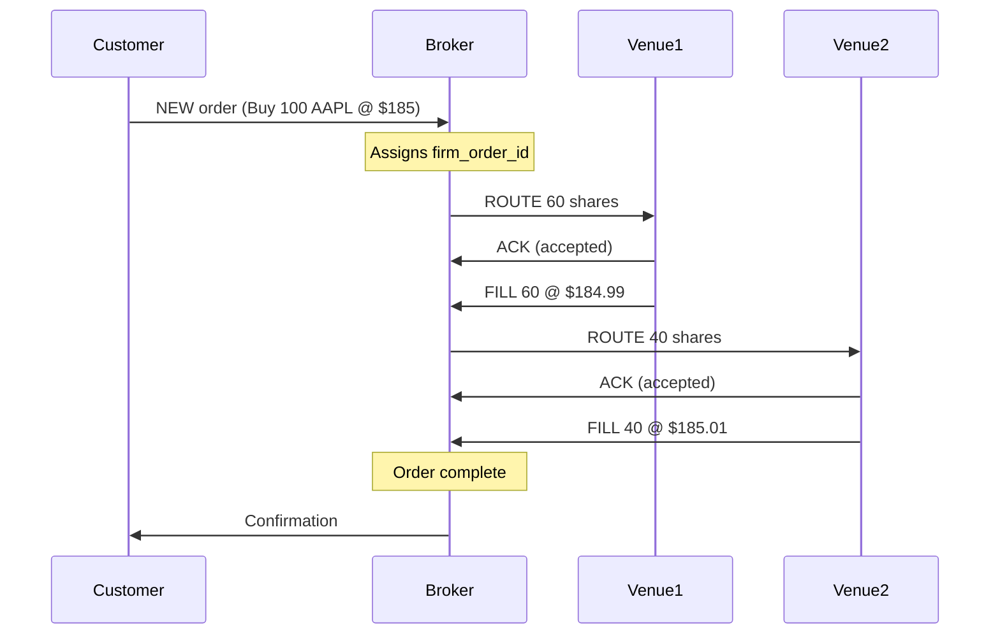
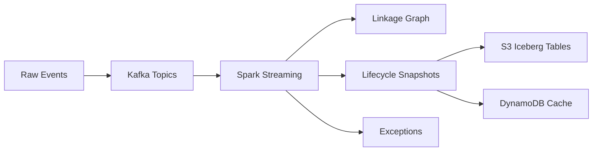

# Overview: What is CAT and Lifecycle Reconstruction?

## Introduction

Welcome to the Simplified Consolidated Audit Trail (CAT) educational project. This system teaches you how to build streaming infrastructure that reconstructs complete order lifecycles across distributed financial systems.

## What is an Order Lifecycle?

In securities trading, an order goes through multiple stages:



Each step generates an **event**. These events may:
- Arrive out of order (network delays)
- Arrive late (system failures, retries)
- Be duplicated (retry logic)
- Reference each other through identifiers

## The Challenge: Distributed Lifecycle Reconstruction

In a distributed system:
- Events are generated by multiple independent systems
- No single system has the complete picture
- Events must be linked together to understand what happened
- Regulators need a complete, accurate audit trail

This is exactly what the **Consolidated Audit Trail (CAT)** solves for U.S. securities markets.

## What You'll Build

A streaming system that:

1. **Ingests** lifecycle events from multiple sources
2. **Links** events using parent-child relationships
3. **Materializes** complete lifecycle snapshots
4. **Validates** data quality and sequence correctness
5. **Handles** late-arriving events through reconciliation
6. **Ensures** idempotency (duplicate events don't corrupt state)
7. **Maintains** an immutable audit trail

## Core Concepts

### Event Sourcing

Instead of storing current state, we store **all events** that led to that state. The current state is derived by replaying events.

Benefits:
- Complete audit trail
- Time travel (reconstruct state at any point)
- Debugging (see exactly what happened)
- Regulatory compliance

### Linkage Identifiers

Events contain IDs that connect them:

```
NEW event:
  customer_order_id: "COID-123"
  firm_order_id: "FOID-456"

ROUTE event:
  parent_firm_order_id: "FOID-456"  ← links to NEW
  firm_order_id: "FOID-789"         ← new child order
  route_id: "RID-001"

FILL event:
  firm_order_id: "FOID-789"         ← links to ROUTE
  route_id: "RID-001"
  exec_id: "EID-AAA"
```

By following these links, we reconstruct the complete lifecycle graph.

### Event Time vs. Processing Time

- **Event time**: When the event actually occurred (source timestamp)
- **Processing time**: When our system processes it

These can differ significantly! A FILL event might arrive before the ACK event due to network delays.

### Watermarks and Late Data

A **watermark** is a threshold: "I don't expect events older than X seconds anymore."

When late events arrive after the watermark:
- We must **reconcile** - update previously computed lifecycles
- We must **audit** - record that we made a correction
- We must **validate** - ensure the correction makes sense

## Why This Matters

### For Regulators (SEC, FINRA)

- Detect market manipulation
- Investigate trading anomalies
- Ensure fair markets
- Audit broker compliance

### For Computer Scientists

- Distributed systems correctness
- Stream processing patterns
- Event-driven architecture
- Data quality at scale

### For You (Students)

- Real-world streaming problem
- AWS serverless architecture
- Terraform infrastructure-as-code
- Production-grade patterns

## System Architecture Preview



## What's Next?

Continue to [01-sec-rule-613-and-cat.md](01-sec-rule-613-and-cat.md) to understand the regulatory context and real-world CAT system.

## Key Takeaways

- Order lifecycles span multiple systems and events
- Events must be linked to reconstruct complete stories
- Late and out-of-order data is normal in distributed systems
- Event sourcing provides complete audit trails
- This is a simplified educational version of real CAT infrastructure
