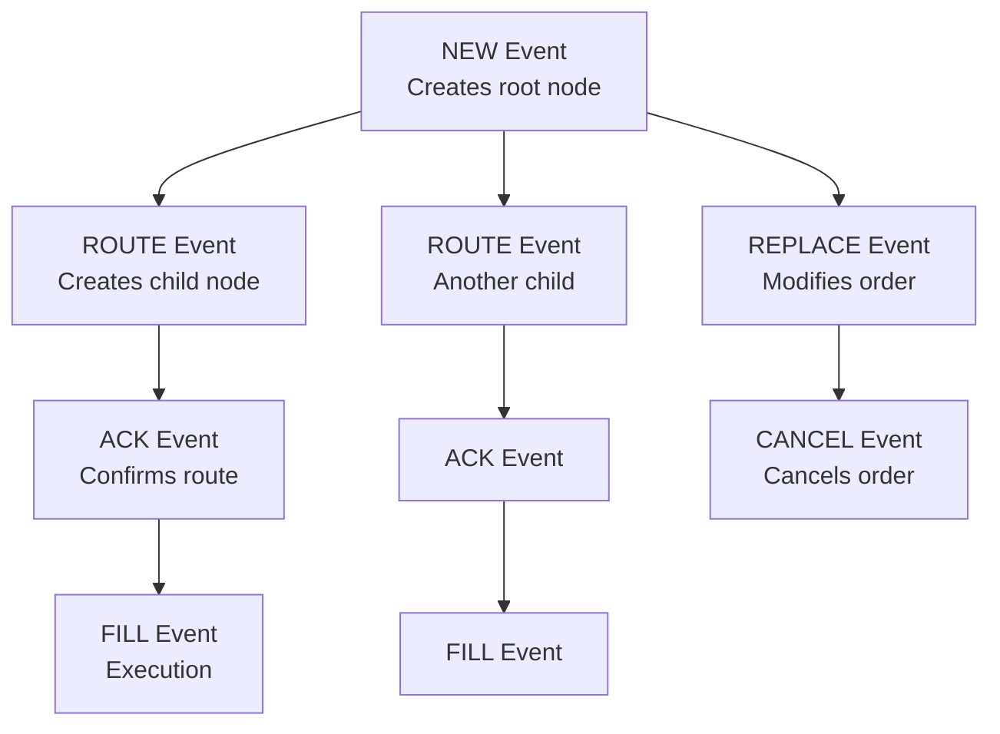

# Event Sourcing for CAT: Core Distributed Systems Concepts

## What is Event Sourcing?

Event sourcing is a pattern where:
- **State changes are stored as events** (not just current state)
- **Current state is derived** by replaying events
- **Events are immutable** (never modified, only appended)
- **Complete history is preserved** for audit and debugging

### Traditional State Storage vs. Event Sourcing

**Traditional (State-Oriented)**:
```
Order Table:
order_id | symbol | qty | filled_qty | status    | last_updated
---------|--------|-----|------------|-----------|-------------
FOID-123 | AAPL   | 100 | 100        | FILLED    | 2026-02-16 10:05:23
```

You know the current state, but not how you got there.

**Event Sourcing**:
```
Event Log:
event_id | event_type | order_id | qty | ts_event
---------|------------|----------|-----|----------
E1       | NEW        | FOID-123 | 100 | 10:00:00
E2       | ROUTE      | FOID-123 | 60  | 10:00:15
E3       | FILL       | FOID-123 | 60  | 10:00:18
E4       | ROUTE      | FOID-123 | 40  | 10:00:20
E5       | FILL       | FOID-123 | 40  | 10:00:25
```

You can reconstruct the complete story and derive current state.

## Why Event Sourcing for CAT?

### 1. Regulatory Audit Trail

Regulators need to see:
- What happened (events)
- When it happened (timestamps)
- Why it happened (context)
- Who did it (firm, account)

Event sourcing provides this naturally.

### 2. Time Travel

Reconstruct state at any point in time:
- "What was the order status at 10:00:20?"
- "How many shares were filled before the cancel?"
- "When did the first execution occur?"

### 3. Debugging and Investigation

When something goes wrong:
- Replay events to reproduce the issue
- See exact sequence of operations
- Identify where logic failed

### 4. Late Data Handling

Events can arrive late:
- Network delays
- System failures
- Retry logic

Event sourcing lets you insert late events and recompute state.

## Event Sourcing in Distributed Systems

### The Challenge

In CAT-like systems:
- Events come from multiple sources (brokers, venues)
- No global clock (timestamps are approximate)
- Network delays cause reordering
- Systems fail and retry (duplicates)

### The Solution: Event Time Semantics

Use **event time** (when event occurred) not **processing time** (when we see it):

```python
# Event schema
{
    "event_id": "uuid",           # Idempotency key
    "ts_event": 1710000000000,    # Event time (source)
    "ts_ingest": 1710000000123,   # Processing time (system)
    "event_type": "FILL",
    "firm_order_id": "FOID-123"
}
```

### Watermarks

A **watermark** is a threshold: "I don't expect events older than this."

```
Current time: 10:05:00
Watermark delay: 30 seconds
Watermark: 10:04:30

Events with ts_event < 10:04:30 are "late"
```

**Why watermarks matter**:
- Allow bounded waiting for late events
- Enable state finalization
- Trigger reconciliation for very late events

### Idempotency

Events may be duplicated (retries, failures). Use `event_id` to deduplicate:

```python
# Spark Structured Streaming
events = spark.readStream \
    .format("kafka") \
    .load() \
    .dropDuplicates(["event_id"])  # Idempotency
```

## Lifecycle Reconstruction as Event Sourcing

### Events as Building Blocks

Each event type contributes to lifecycle:



### Linkage as Event Correlation

Events reference each other:

```json
{
  "event_type": "ROUTE",
  "firm_order_id": "FOID-789",
  "parent_firm_order_id": "FOID-456",  // Links to parent NEW
  "route_id": "RID-001"
}
```

This creates a **directed acyclic graph (DAG)** of lifecycle events.

### State Materialization

From events, we derive lifecycle snapshots:

```python
# Pseudo-code
def materialize_lifecycle(events):
    lifecycle = {
        "customer_order_id": events[0].customer_order_id,
        "root_firm_order_id": events[0].firm_order_id,
        "status": "OPEN",
        "total_qty": events[0].qty,
        "filled_qty": 0,
        "routes": [],
        "executions": []
    }
    
    for event in events:
        if event.event_type == "ROUTE":
            lifecycle["routes"].append(event)
        elif event.event_type == "FILL":
            lifecycle["filled_qty"] += event.qty
            lifecycle["executions"].append(event)
        elif event.event_type == "CANCEL":
            lifecycle["status"] = "CANCELED"
    
    if lifecycle["filled_qty"] == lifecycle["total_qty"]:
        lifecycle["status"] = "FILLED"
    
    return lifecycle
```

## Handling Late Events: Reconciliation

### Scenario

```
10:00:00 - NEW order arrives
10:00:15 - ROUTE arrives
10:00:25 - FILL arrives (but ACK is missing)
10:05:00 - Watermark passes (30s delay)
          → Lifecycle marked "provisional" (missing ACK)
10:10:00 - ACK arrives (late!)
          → Must reconcile lifecycle
```

### Reconciliation Process

1. **Detect late event**: `ts_event < watermark`
2. **Retrieve affected lifecycle**: Find by `firm_order_id`
3. **Recompute lifecycle**: Replay all events including late one
4. **Emit correction**: Write to `audit.v1` topic
5. **Update snapshot**: Overwrite lifecycle in storage

```python
# Spark Structured Streaming with watermark
events_with_watermark = events \
    .withWatermark("ts_event", "30 seconds")

# Late events trigger state updates
lifecycles = events_with_watermark \
    .groupBy("customer_order_id") \
    .apply(materialize_lifecycle_with_late_handling)
```

## Immutable Audit Trail

All derived decisions are logged:

```json
{
  "audit_id": "uuid",
  "ts_audit": 1710000600000,
  "action": "LIFECYCLE_CORRECTION",
  "reason": "Late ACK event received",
  "customer_order_id": "COID-123",
  "previous_status": "PROVISIONAL",
  "new_status": "CONFIRMED",
  "late_event_id": "E-ACK-456"
}
```

This creates an audit trail of the audit trail!

## Data Quality Validation

Event sourcing enables validation:

### Sequence Checks

```python
# Execution can't precede order
if fill_event.ts_event < new_event.ts_event:
    emit_exception("FILL_BEFORE_NEW")
```

### Completeness Checks

```python
# Route must have outcome (ACK or REJECT)
if route_event and not (ack_event or reject_event):
    emit_exception("ROUTE_NO_OUTCOME")
```

### Quantity Checks

```python
# Can't fill more than ordered
if lifecycle.filled_qty > lifecycle.total_qty:
    emit_exception("OVERFILL")
```

## Event Sourcing Patterns in This Project

| Pattern | Implementation |
|---------|---------------|
| Event Store | Kafka topics (immutable log) |
| Event Schema | JSON with versioning (`cat.events.v1`) |
| Idempotency | `event_id` deduplication |
| Event Time | `ts_event` field + watermarks |
| State Materialization | Spark aggregations → Iceberg tables |
| Audit Trail | `audit.v1` topic for corrections |
| Linkage | Parent/child IDs in events |
| Validation | Exception detection → `cat.exceptions.v1` |

## Benefits for Students

Understanding event sourcing teaches:
- Distributed systems correctness
- Temporal reasoning (event time vs. processing time)
- State management in streaming systems
- Debugging complex distributed workflows
- Regulatory compliance patterns

## Common Pitfalls

### 1. Confusing Event Time and Processing Time

```python
# WRONG: Using processing time
events.groupBy(window("ts_ingest", "1 minute"))

# RIGHT: Using event time
events.groupBy(window("ts_event", "1 minute"))
```

### 2. Not Handling Duplicates

```python
# WRONG: Assuming events are unique
events.groupBy("order_id").count()

# RIGHT: Deduplicating first
events.dropDuplicates(["event_id"]).groupBy("order_id").count()
```

### 3. Ignoring Late Data

```python
# WRONG: No watermark (unbounded state)
events.groupBy("order_id").agg(...)

# RIGHT: Watermark for bounded state
events.withWatermark("ts_event", "30 seconds") \
    .groupBy("order_id").agg(...)
```

## What's Next?

Continue to [03-identifiers-and-linkages.md](03-identifiers-and-linkages.md) to understand how identifiers connect events into lifecycles.

## Key Takeaways

- Event sourcing stores state changes as immutable events
- Current state is derived by replaying events
- Event time (not processing time) determines correctness
- Watermarks enable bounded waiting for late events
- Idempotency prevents duplicate event corruption
- Reconciliation updates state when late events arrive
- Immutable audit trails enable regulatory compliance
- Validation rules ensure data quality
