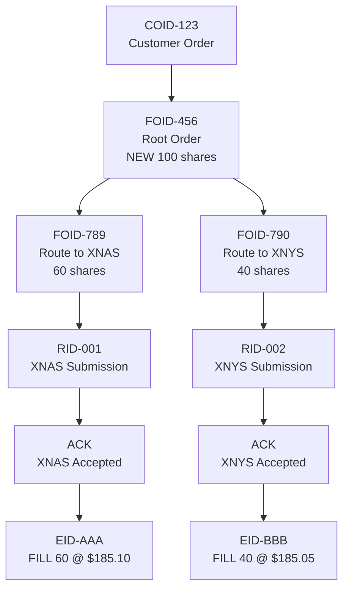

# Identifiers and Linkages: Connecting Events into Lifecycles

## The Identifier Problem

In a distributed trading system:
- Customer places order at broker → generates `customer_order_id`
- Broker routes to venue A → generates `route_id_A`
- Broker routes to venue B → generates `route_id_B`
- Venue A executes → generates `exec_id_A`
- Venue B executes → generates `exec_id_B`

**Question**: How do we know these 5 events are related?

**Answer**: Linkage identifiers.

## Core Identifiers in Our System

### 1. customer_order_id

- **Scope**: Stable across entire lifecycle
- **Generated by**: Customer or broker at order inception
- **Purpose**: Root identifier for the logical order
- **Example**: `COID-20260216-A123-0001`

```json
{
  "event_type": "NEW",
  "customer_order_id": "COID-20260216-A123-0001",
  "account_id": "A123",
  "symbol": "AAPL",
  "qty": 100
}
```

### 2. firm_order_id

- **Scope**: Unique per order node (parent or child)
- **Generated by**: Broker for each order instance
- **Purpose**: Track order versions and child routes
- **Example**: `FOID-20260216-DEMO-0001`

**Key insight**: A single `customer_order_id` may have multiple `firm_order_id` values:
- Original order: `FOID-001`
- After replace: `FOID-002`
- Child route 1: `FOID-003`
- Child route 2: `FOID-004`

### 3. parent_firm_order_id

- **Scope**: References the parent order
- **Generated by**: Broker when creating child orders
- **Purpose**: Link child to parent
- **Example**: `FOID-20260216-DEMO-0001`

```json
{
  "event_type": "ROUTE",
  "firm_order_id": "FOID-003",
  "parent_firm_order_id": "FOID-001",  // Links to parent
  "route_id": "RID-001"
}
```

### 4. route_id

- **Scope**: Unique per venue submission
- **Generated by**: Broker when routing to venue
- **Purpose**: Track specific venue submission
- **Example**: `RID-20260216-XNAS-0001`

### 5. exec_id

- **Scope**: Unique per execution
- **Generated by**: Venue when execution occurs
- **Purpose**: Identify specific fill
- **Example**: `EID-20260216-XNAS-0001`

### 6. event_id

- **Scope**: Unique per event (globally)
- **Generated by**: Event producer
- **Purpose**: Idempotency key (deduplication)
- **Example**: `550e8400-e29b-41d4-a716-446655440000` (UUID)

## Linkage Patterns

### Pattern 1: Root Order Creation

```json
{
  "event_id": "E1",
  "event_type": "NEW",
  "customer_order_id": "COID-123",
  "firm_order_id": "FOID-456",
  "parent_firm_order_id": null
}
```

**Graph**:
```
COID-123 → FOID-456 (root)
```

### Pattern 2: Order Routing (Parent → Child)

```json
{
  "event_id": "E2",
  "event_type": "ROUTE",
  "customer_order_id": "COID-123",
  "firm_order_id": "FOID-789",
  "parent_firm_order_id": "FOID-456",  // Links to root
  "route_id": "RID-001",
  "venue": "XNAS"
}
```

**Graph**:
```
COID-123 → FOID-456 (root)
             ↓
           FOID-789 (child route)
             ↓
           RID-001 (venue submission)
```

### Pattern 3: Execution

```json
{
  "event_id": "E3",
  "event_type": "FILL",
  "customer_order_id": "COID-123",
  "firm_order_id": "FOID-789",
  "route_id": "RID-001",
  "exec_id": "EID-AAA",
  "exec_price": 185.10,
  "qty": 60
}
```

**Graph**:
```
COID-123 → FOID-456 (root)
             ↓
           FOID-789 (child route)
             ↓
           RID-001 (venue submission)
             ↓
           EID-AAA (execution)
```

### Pattern 4: Order Replace (Version Chain)

```json
{
  "event_id": "E4",
  "event_type": "REPLACE",
  "customer_order_id": "COID-123",
  "firm_order_id": "FOID-999",
  "parent_firm_order_id": "FOID-456",  // Links to original
  "reason": "Price change"
}
```

**Graph**:
```
COID-123 → FOID-456 (original)
             ↓
           FOID-999 (replaced version)
```

### Pattern 5: Multiple Routes (Fan-out)

```json
// Route 1
{
  "event_type": "ROUTE",
  "firm_order_id": "FOID-789",
  "parent_firm_order_id": "FOID-456",
  "route_id": "RID-001",
  "venue": "XNAS",
  "qty": 60
}

// Route 2
{
  "event_type": "ROUTE",
  "firm_order_id": "FOID-790",
  "parent_firm_order_id": "FOID-456",
  "route_id": "RID-002",
  "venue": "XNYS",
  "qty": 40
}
```

**Graph**:
```
COID-123 → FOID-456 (root)
             ↓
        ┌────┴────┐
        ↓         ↓
    FOID-789  FOID-790
    RID-001   RID-002
    (XNAS)    (XNYS)
```

## Complete Lifecycle Example



## Linkage Graph Construction

### Edge Types

Our system emits edges to `cat.linkages.v1`:

```python
# Edge schema
{
    "edge_id": "uuid",
    "edge_type": "ROOT|ROUTE|REPLACE|FILL|CANCEL|BUST",
    "source_id": "FOID-456",
    "target_id": "FOID-789",
    "customer_order_id": "COID-123",
    "ts_event": 1710000000000
}
```

### Edge Construction Rules

```python
def construct_edges(event):
    edges = []
    
    if event.event_type == "NEW":
        # Root edge: customer_order_id → firm_order_id
        edges.append({
            "edge_type": "ROOT",
            "source_id": event.customer_order_id,
            "target_id": event.firm_order_id
        })
    
    elif event.event_type == "ROUTE":
        # Parent → child edge
        edges.append({
            "edge_type": "ROUTE",
            "source_id": event.parent_firm_order_id,
            "target_id": event.firm_order_id
        })
        # Child → route_id edge
        edges.append({
            "edge_type": "ROUTE",
            "source_id": event.firm_order_id,
            "target_id": event.route_id
        })
    
    elif event.event_type == "FILL":
        # route_id → exec_id edge
        edges.append({
            "edge_type": "FILL",
            "source_id": event.route_id,
            "target_id": event.exec_id
        })
    
    # ... similar for REPLACE, CANCEL, BUST
    
    return edges
```

## Validation Using Linkages

### Missing Parent

```python
# ROUTE event references unknown parent
if event.event_type == "ROUTE":
    if not exists(event.parent_firm_order_id):
        emit_exception("MISSING_PARENT", event)
```

### Orphaned Execution

```python
# FILL event references unknown route
if event.event_type == "FILL":
    if not exists(event.route_id):
        emit_exception("ORPHANED_EXECUTION", event)
```

### Circular References

```python
# Detect cycles in linkage graph
def detect_cycles(edges):
    graph = build_graph(edges)
    visited = set()
    rec_stack = set()
    
    for node in graph:
        if has_cycle(node, visited, rec_stack, graph):
            emit_exception("CIRCULAR_LINKAGE", node)
```

## Querying Lifecycles

### By Customer Order ID

```sql
-- Get all events for a customer order
SELECT *
FROM cat_events
WHERE customer_order_id = 'COID-123'
ORDER BY ts_event;
```

### By Firm Order ID (with children)

```sql
-- Get order and all descendants
WITH RECURSIVE descendants AS (
  -- Root
  SELECT firm_order_id, parent_firm_order_id, 0 as depth
  FROM cat_events
  WHERE firm_order_id = 'FOID-456'
  
  UNION ALL
  
  -- Children
  SELECT e.firm_order_id, e.parent_firm_order_id, d.depth + 1
  FROM cat_events e
  JOIN descendants d ON e.parent_firm_order_id = d.firm_order_id
)
SELECT * FROM descendants;
```

### Execution Path

```sql
-- Trace execution back to root order
SELECT 
  e.exec_id,
  e.route_id,
  e.firm_order_id,
  e.parent_firm_order_id,
  e.customer_order_id
FROM cat_events e
WHERE e.exec_id = 'EID-AAA';
```

## Identifier Best Practices

### 1. Use UUIDs for Global Uniqueness

```python
import uuid

event_id = str(uuid.uuid4())
# "550e8400-e29b-41d4-a716-446655440000"
```

### 2. Include Context in Human-Readable IDs

```python
# Good: Includes date, firm, sequence
firm_order_id = f"FOID-{date}-{firm_id}-{sequence}"
# "FOID-20260216-DEMO-0001"

# Bad: Opaque
firm_order_id = "12345"
```

### 3. Validate Linkages at Ingestion

```python
def validate_event(event):
    if event.event_type == "ROUTE":
        assert event.parent_firm_order_id is not None
        assert event.route_id is not None
    
    if event.event_type == "FILL":
        assert event.exec_id is not None
        assert event.route_id is not None
```

### 4. Index by Multiple Identifiers

```python
# DynamoDB table design
{
    "PK": "COID#COID-123",           # Partition key
    "SK": "FOID#FOID-456",           # Sort key
    "GSI1PK": "FOID#FOID-456",       # Global secondary index
    "GSI1SK": "EVENT#1710000000000"
}
```

## What's Next?

Continue to [04-streaming-architecture.md](04-streaming-architecture.md) to see how these identifiers flow through the system architecture.

## Key Takeaways

- Identifiers connect distributed events into coherent lifecycles
- `customer_order_id` is the stable root identifier
- `firm_order_id` tracks order versions and child routes
- `parent_firm_order_id` creates parent-child linkages
- `route_id` and `exec_id` track venue interactions
- `event_id` enables idempotency
- Linkage graphs enable lifecycle reconstruction
- Validation rules detect missing or invalid linkages
- Proper indexing enables efficient lifecycle queries
