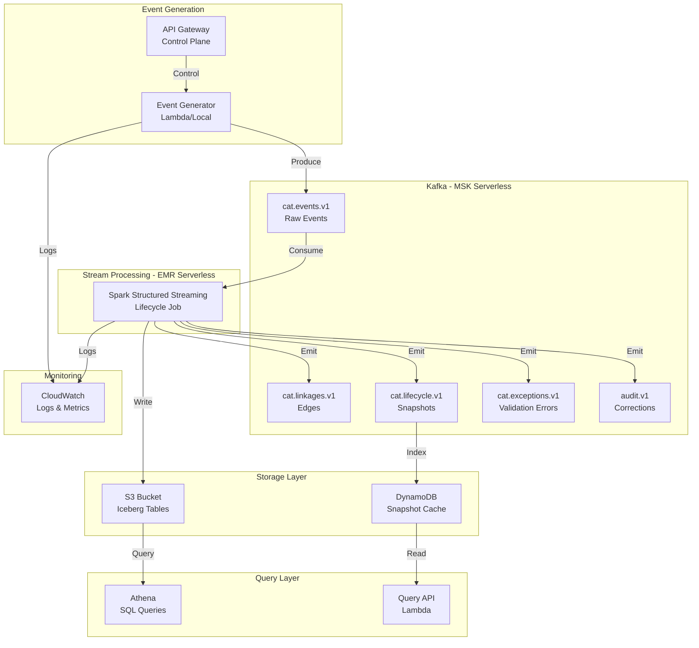
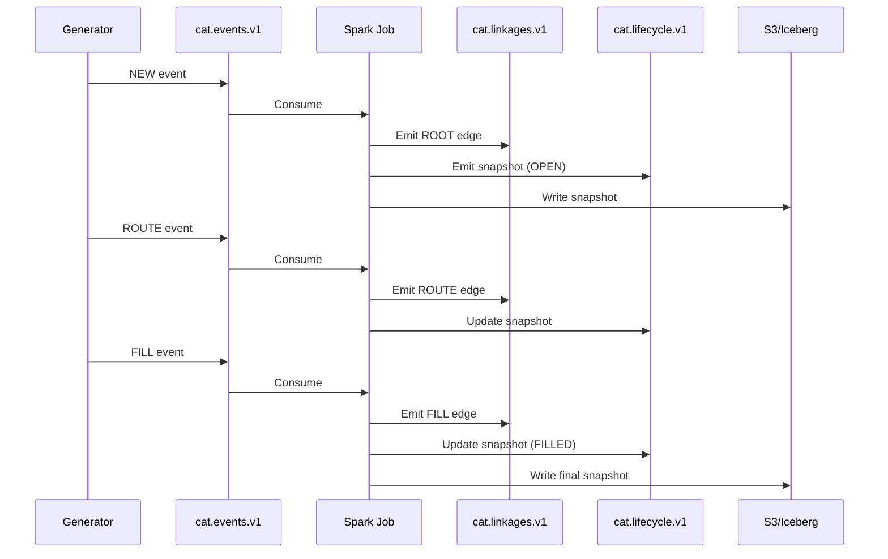
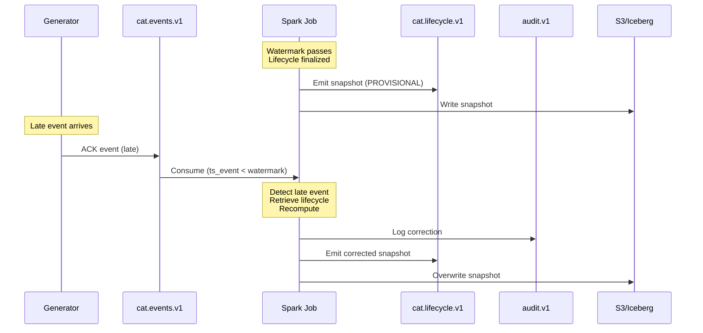

# Streaming Architecture: System Design and Data Flow

## System Overview



## Kafka Topics

### Topic Design Principles

1. **Versioned schemas**: All topics end with `.v1` for schema evolution
2. **Partitioning**: By `customer_order_id` for co-location
3. **Retention**: 7 days for derived topics, 30 days for raw events
4. **Replication**: 3 replicas for durability (AWS MSK default)

### Topic Specifications

#### cat.events.v1 (Input)

**Purpose**: Raw lifecycle events from all sources

**Schema**:
```json
{
  "event_id": "uuid",
  "event_type": "NEW|ROUTE|ACK|REPLACE|CANCEL|FILL|BUST",
  "ts_event": 1710000000000,
  "ts_ingest": 1710000000123,
  "firm_id": "DEMO_BROKER",
  "account_id": "A123",
  "customer_order_id": "COID-...",
  "firm_order_id": "FOID-...",
  "parent_firm_order_id": "FOID-...",
  "route_id": "RID-...",
  "venue": "XNAS|XNYS|IEX|BATS|EDGX",
  "exec_id": "EID-...",
  "symbol": "AAPL",
  "qty": 100,
  "side": "BUY|SELL",
  "order_type": "MARKET|LIMIT",
  "limit_price": 185.10,
  "exec_price": 185.09,
  "reason": "optional",
  "corr_id": "uuid"
}
```

**Partitioning**: `customer_order_id` (ensures all events for an order go to same partition)

**Producers**: Event generator Lambda, external systems

#### cat.linkages.v1 (Derived)

**Purpose**: Parent-child edges for lifecycle graph

**Schema**:
```json
{
  "edge_id": "uuid",
  "edge_type": "ROOT|ROUTE|REPLACE|FILL|CANCEL|BUST",
  "source_id": "FOID-456",
  "target_id": "FOID-789",
  "customer_order_id": "COID-123",
  "ts_event": 1710000000000,
  "metadata": {}
}
```

**Partitioning**: `customer_order_id`

**Producers**: Spark lifecycle job

#### cat.lifecycle.v1 (Derived)

**Purpose**: Materialized lifecycle snapshots

**Schema**:
```json
{
  "customer_order_id": "COID-123",
  "root_firm_order_id": "FOID-456",
  "account_id": "A123",
  "symbol": "AAPL",
  "side": "BUY",
  "total_qty": 100,
  "filled_qty": 100,
  "avg_exec_price": 185.08,
  "status": "FILLED",
  "active_routes": [],
  "executions": [
    {"exec_id": "EID-AAA", "qty": 60, "price": 185.10},
    {"exec_id": "EID-BBB", "qty": 40, "price": 185.05}
  ],
  "ts_first_event": 1710000000000,
  "ts_last_event": 1710000025000,
  "ts_snapshot": 1710000030000,
  "is_provisional": false
}
```

**Partitioning**: `customer_order_id`

**Producers**: Spark lifecycle job

**Consumers**: DynamoDB indexer, monitoring

#### cat.exceptions.v1 (Derived)

**Purpose**: Data quality violations

**Schema**:
```json
{
  "exception_id": "uuid",
  "exception_type": "FILL_BEFORE_NEW|MISSING_PARENT|OVERFILL|...",
  "severity": "ERROR|WARNING",
  "customer_order_id": "COID-123",
  "firm_order_id": "FOID-456",
  "event_id": "E1",
  "description": "Execution timestamp precedes order timestamp",
  "ts_detected": 1710000030000,
  "metadata": {}
}
```

**Partitioning**: `customer_order_id`

**Producers**: Spark lifecycle job

**Consumers**: Exception indexer, alerting

#### audit.v1 (Derived)

**Purpose**: Immutable audit trail of corrections

**Schema**:
```json
{
  "audit_id": "uuid",
  "action": "LIFECYCLE_CORRECTION|STATE_UPDATE|...",
  "customer_order_id": "COID-123",
  "reason": "Late ACK event received",
  "previous_state": {},
  "new_state": {},
  "triggering_event_id": "E-ACK-456",
  "ts_audit": 1710000600000
}
```

**Partitioning**: `customer_order_id`

**Producers**: Spark lifecycle job

**Consumers**: Compliance, auditing

## Data Flow

### Normal Flow (In-Order Events)



### Late Data Flow (Reconciliation)



## Spark Structured Streaming Job

### Job Architecture

```python
# High-level structure
events = spark.readStream \
    .format("kafka") \
    .option("kafka.bootstrap.servers", bootstrap_servers) \
    .option("subscribe", "cat.events.v1") \
    .load()

# Parse and deduplicate
parsed = events \
    .select(from_json(col("value"), event_schema).alias("data")) \
    .select("data.*") \
    .dropDuplicates(["event_id"])

# Apply watermark for late data handling
with_watermark = parsed \
    .withWatermark("ts_event", "30 seconds")

# Build linkages
linkages = with_watermark \
    .flatMap(construct_edges)

# Materialize lifecycles
lifecycles = with_watermark \
    .groupBy("customer_order_id") \
    .agg(materialize_lifecycle)

# Validate and emit exceptions
exceptions = lifecycles \
    .flatMap(validate_lifecycle)

# Write outputs
linkages.writeStream.to("cat.linkages.v1")
lifecycles.writeStream.to("cat.lifecycle.v1")
exceptions.writeStream.to("cat.exceptions.v1")
lifecycles.writeStream.format("iceberg").to("s3://bucket/lifecycles")
```

### State Management

Spark maintains state for:
- **Deduplication**: `event_id` seen set (TTL: watermark + 1 hour)
- **Lifecycle aggregation**: Current snapshot per `customer_order_id`
- **Linkage graph**: Edges for validation

State is checkpointed to S3 for fault tolerance.

### Watermark Configuration

```python
# Watermark delay: how long to wait for late events
watermark_delay = "30 seconds"

# Events arriving after watermark trigger reconciliation
# Trade-off:
# - Shorter delay: Faster finalization, more reconciliations
# - Longer delay: Fewer reconciliations, slower finalization
```

## AWS Serverless Components

### MSK Serverless

**Configuration**:
- Cluster type: Serverless
- Capacity: Auto-scaling (1-4 MCUs)
- Networking: Private subnets, VPC endpoints
- Security: IAM authentication

**Cost optimization**:
- Use serverless (pay per GB ingested/egested)
- Enable compression (gzip)
- Tune retention (7-30 days)

### EMR Serverless

**Configuration**:
- Application type: Spark 3.5
- Runtime: EMR 7.0
- Pre-initialized capacity: 1 worker (for low latency)
- Max capacity: 10 workers (for burst)

**Job submission**:
```bash
aws emr-serverless start-job-run \
  --application-id $APP_ID \
  --execution-role-arn $ROLE_ARN \
  --job-driver '{
    "sparkSubmit": {
      "entryPoint": "s3://bucket/lifecycle_streaming.py",
      "sparkSubmitParameters": "--conf spark.sql.streaming.checkpointLocation=s3://bucket/checkpoints/"
    }
  }'
```

### Lambda Functions

#### Event Generator

**Runtime**: Python 3.11  
**Memory**: 512 MB  
**Timeout**: 5 minutes  
**Trigger**: API Gateway, EventBridge schedule

**Environment variables**:
- `KAFKA_BOOTSTRAP_SERVERS`
- `EVENT_RATE_PER_SECOND`
- `MODE` (normal/late/duplicate/chaos)

#### Operator API

**Runtime**: Python 3.11  
**Memory**: 256 MB  
**Timeout**: 30 seconds  
**Trigger**: API Gateway HTTP API

**Endpoints**:
- `POST /generator/start`
- `POST /generator/mode`
- `POST /generator/stop`
- `GET /health`
- `GET /stats`

### DynamoDB

**Table**: `cat-lifecycle-snapshots`

**Schema**:
```
PK: customer_order_id (String)
SK: "LATEST" (String)
Attributes: lifecycle snapshot JSON
TTL: ts_snapshot + 30 days
```

**Indexes**:
- GSI1: `symbol` + `ts_snapshot` (for symbol queries)
- GSI2: `status` + `ts_snapshot` (for status queries)

### S3 + Iceberg

**Bucket structure**:
```
s3://cat-demo-bucket/
  ├── spark-jobs/
  │   └── lifecycle_streaming.py
  ├── checkpoints/
  │   └── lifecycle-job/
  ├── iceberg/
  │   ├── lifecycles/
  │   │   ├── metadata/
  │   │   └── data/
  │   │       ├── date=2026-02-16/
  │   │       │   ├── symbol=AAPL/
  │   │       │   └── symbol=MSFT/
  │   └── exceptions/
  └── logs/
```

**Iceberg benefits**:
- Schema evolution
- Time travel
- ACID transactions
- Partition evolution

## Networking

### VPC Architecture

```
VPC: 10.0.0.0/16
├── Private Subnet 1: 10.0.1.0/24 (AZ1)
│   ├── MSK broker 1
│   └── Lambda (event generator)
├── Private Subnet 2: 10.0.2.0/24 (AZ2)
│   ├── MSK broker 2
│   └── Lambda (event generator)
└── Private Subnet 3: 10.0.3.0/24 (AZ3)
    └── MSK broker 3

VPC Endpoints:
├── S3 (Gateway endpoint)
├── DynamoDB (Gateway endpoint)
└── CloudWatch Logs (Interface endpoint)
```

**Low-cost mode**: Single AZ, no NAT gateway, VPC endpoints only

### Security Groups

```hcl
# MSK security group
resource "aws_security_group" "msk" {
  ingress {
    from_port   = 9098  # IAM auth
    to_port     = 9098
    protocol    = "tcp"
    security_groups = [
      aws_security_group.lambda.id,
      aws_security_group.spark.id
    ]
  }
}

# Lambda security group
resource "aws_security_group" "lambda" {
  egress {
    from_port   = 0
    to_port     = 0
    protocol    = "-1"
    cidr_blocks = ["0.0.0.0/0"]
  }
}
```

## Monitoring and Observability

### CloudWatch Metrics

**Kafka metrics**:
- `BytesInPerSec`
- `BytesOutPerSec`
- `MessagesInPerSec`

**Spark metrics**:
- `numInputRows`
- `inputRowsPerSecond`
- `processedRowsPerSecond`
- `stateMemoryUsedBytes`

**Custom metrics**:
- `LifecyclesProcessed`
- `ExceptionsDetected`
- `LateEventsReceived`
- `ReconciliationsPerformed`

### CloudWatch Logs

**Log groups**:
- `/aws/lambda/event-generator`
- `/aws/lambda/operator-api`
- `/aws/emr-serverless/applications/{app-id}/jobs/{job-id}`

### Dashboards

Create dashboard showing:
- Event ingestion rate
- Processing lag
- Exception rate by type
- Late event rate
- Lifecycle completion time (p50, p95, p99)

## Scalability

### Horizontal Scaling

**Kafka partitions**: 6 partitions per topic (2x worker count)

**Spark workers**: Auto-scale 1-10 based on backlog

**Lambda concurrency**: Reserved concurrency per function

### Vertical Scaling

**Spark executor memory**: 4 GB per executor

**Spark executor cores**: 2 cores per executor

## Cost Optimization

### Low-Cost Mode

Enable via Terraform variable:
```hcl
variable "low_cost_mode" {
  default = true
}
```

Changes:
- Single AZ deployment
- Minimal MSK capacity (1 MCU)
- Minimal EMR pre-initialized capacity
- Shorter retention (7 days)
- No NAT gateway

**Estimated cost**: $50-100/month for demo usage

### Cost Monitoring

Tag all resources:
```hcl
tags = {
  Project     = "cat-demo"
  Environment = "dev"
  Owner       = "student@uncc.edu"
  CostCenter  = "education"
}
```

Use AWS Cost Explorer to track by tag.

## What's Next?

Continue to [05-spark-lifecycle-job.md](05-spark-lifecycle-job.md) for detailed Spark implementation.

## Key Takeaways

- Kafka topics separate concerns (raw, derived, exceptions, audit)
- Spark Structured Streaming provides exactly-once semantics
- Watermarks enable bounded state and late data handling
- AWS serverless components minimize operational overhead
- VPC architecture ensures security and cost efficiency
- Monitoring and observability are critical for production systems
- Low-cost mode enables affordable student experimentation
