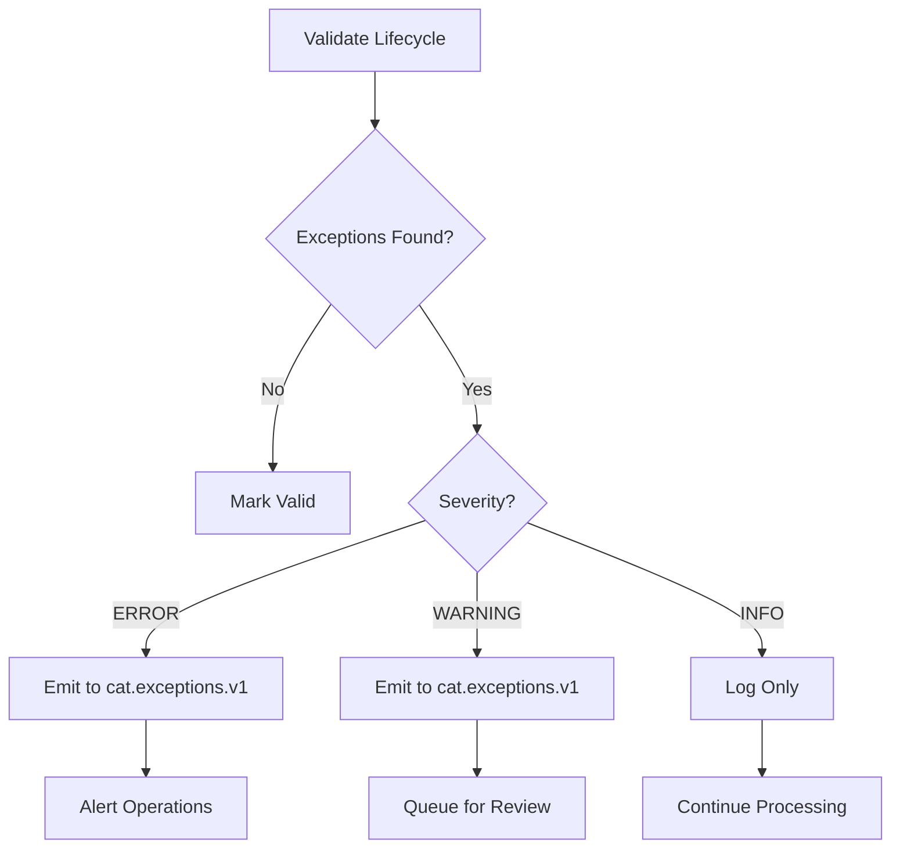

# Data Quality Controls

## Overview

Data quality is critical for regulatory compliance. Our system implements validation rules inspired by FINRA's CAT guidance ([Notice 20-31](https://www.finra.org/rules-guidance/notices/20-31)).

## Validation Rules

### 1. Sequence Validation

**Rule**: Events must occur in logical order

**Checks**:
- FILL timestamp >= ACK timestamp
- ACK timestamp >= ROUTE timestamp  
- ROUTE timestamp >= NEW timestamp

**Implementation**:
```python
def validate_sequence(lifecycle):
    exceptions = []
    
    new_ts = lifecycle.ts_first_event
    
    for route in lifecycle.routes:
        if route.ts_event < new_ts:
            exceptions.append({
                "type": "ROUTE_BEFORE_NEW",
                "severity": "ERROR"
            })
    
    for fill in lifecycle.executions:
        if fill.ts_event < new_ts:
            exceptions.append({
                "type": "FILL_BEFORE_NEW",
                "severity": "ERROR"
            })
    
    return exceptions
```

### 2. Linkage Validation

**Rule**: All events must have valid parent references

**Checks**:
- ROUTE references existing parent_firm_order_id
- FILL references existing route_id
- REPLACE references existing parent_firm_order_id

**Implementation**:
```python
def validate_linkages(events):
    firm_order_ids = set()
    route_ids = set()
    exceptions = []
    
    for event in events:
        if event.event_type == "NEW":
            firm_order_ids.add(event.firm_order_id)
        
        elif event.event_type == "ROUTE":
            if event.parent_firm_order_id not in firm_order_ids:
                exceptions.append({
                    "type": "MISSING_PARENT",
                    "event_id": event.event_id
                })
            route_ids.add(event.route_id)
        
        elif event.event_type == "FILL":
            if event.route_id not in route_ids:
                exceptions.append({
                    "type": "ORPHANED_EXECUTION",
                    "event_id": event.event_id
                })
    
    return exceptions
```

### 3. Quantity Validation

**Rule**: Quantities must be consistent

**Checks**:
- filled_qty <= total_qty (no overfill)
- filled_qty >= 0 (no negative fills)
- Sum of route quantities <= total_qty

**Implementation**:
```python
def validate_quantities(lifecycle):
    exceptions = []
    
    if lifecycle.filled_qty > lifecycle.total_qty:
        exceptions.append({
            "type": "OVERFILL",
            "severity": "ERROR",
            "details": {
                "total_qty": lifecycle.total_qty,
                "filled_qty": lifecycle.filled_qty
            }
        })
    
    if lifecycle.filled_qty < 0:
        exceptions.append({
            "type": "NEGATIVE_FILL",
            "severity": "ERROR"
        })
    
    return exceptions
```

### 4. Price Validation

**Rule**: Prices must be reasonable

**Checks**:
- exec_price > 0
- exec_price within reasonable range of limit_price
- No extreme price deviations

**Implementation**:
```python
def validate_prices(lifecycle):
    exceptions = []
    
    for execution in lifecycle.executions:
        if execution.price <= 0:
            exceptions.append({
                "type": "INVALID_PRICE",
                "severity": "ERROR"
            })
        
        if lifecycle.limit_price:
            deviation = abs(execution.price - lifecycle.limit_price)
            if deviation > lifecycle.limit_price * 0.1:  # 10% threshold
                exceptions.append({
                    "type": "PRICE_DEVIATION",
                    "severity": "WARNING"
                })
    
    return exceptions
```

### 5. Completeness Validation

**Rule**: Lifecycles must be complete

**Checks**:
- All routes have outcomes (ACK or REJECT)
- Canceled orders have CANCEL event
- Filled orders have FILL events

**Implementation**:
```python
def validate_completeness(lifecycle):
    exceptions = []
    
    for route in lifecycle.routes:
        if not route.has_ack and not route.has_reject:
            exceptions.append({
                "type": "ROUTE_NO_OUTCOME",
                "severity": "WARNING",
                "route_id": route.route_id
            })
    
    if lifecycle.status == "FILLED" and not lifecycle.executions:
        exceptions.append({
            "type": "FILLED_NO_EXECUTIONS",
            "severity": "ERROR"
        })
    
    return exceptions
```

### 6. Temporal Validation

**Rule**: Timestamps must be reasonable

**Checks**:
- ts_event not in future
- ts_event not too far in past (> 1 year)
- ts_ingest >= ts_event

**Implementation**:
```python
def validate_timestamps(event):
    exceptions = []
    now = int(time.time() * 1000)
    
    if event.ts_event > now:
        exceptions.append({
            "type": "FUTURE_TIMESTAMP",
            "severity": "ERROR"
        })
    
    if now - event.ts_event > 365 * 24 * 3600 * 1000:  # 1 year
        exceptions.append({
            "type": "STALE_EVENT",
            "severity": "WARNING"
        })
    
    if event.ts_ingest < event.ts_event:
        exceptions.append({
            "type": "INGEST_BEFORE_EVENT",
            "severity": "ERROR"
        })
    
    return exceptions
```

## Exception Severity Levels

### ERROR
- Violates fundamental business rules
- Indicates data corruption or system failure
- Requires immediate investigation
- Examples: OVERFILL, MISSING_PARENT, NEGATIVE_FILL

### WARNING
- Unusual but potentially valid
- May indicate late data or edge cases
- Should be reviewed but not blocking
- Examples: PRICE_DEVIATION, ROUTE_NO_OUTCOME, STALE_EVENT

### INFO
- Informational only
- Normal system behavior
- Examples: LATE_EVENT_RECEIVED, LIFECYCLE_CORRECTION

## Comparative Review

FINRA requires firms to perform comparative reviews - reconciling CAT data with internal records.

### Implementation Approach

```python
def comparative_review(cat_lifecycle, internal_lifecycle):
    discrepancies = []
    
    # Compare quantities
    if cat_lifecycle.total_qty != internal_lifecycle.total_qty:
        discrepancies.append({
            "type": "QUANTITY_MISMATCH",
            "cat_value": cat_lifecycle.total_qty,
            "internal_value": internal_lifecycle.total_qty
        })
    
    # Compare executions
    cat_execs = set(e.exec_id for e in cat_lifecycle.executions)
    internal_execs = set(e.exec_id for e in internal_lifecycle.executions)
    
    missing_in_cat = internal_execs - cat_execs
    missing_in_internal = cat_execs - internal_execs
    
    if missing_in_cat:
        discrepancies.append({
            "type": "MISSING_IN_CAT",
            "exec_ids": list(missing_in_cat)
        })
    
    if missing_in_internal:
        discrepancies.append({
            "type": "MISSING_IN_INTERNAL",
            "exec_ids": list(missing_in_internal)
        })
    
    return discrepancies
```

## Exception Handling Workflow



## Monitoring Exception Rates

### CloudWatch Metrics

```python
# Emit custom metrics
cloudwatch.put_metric_data(
    Namespace='CAT/DataQuality',
    MetricData=[
        {
            'MetricName': 'ExceptionRate',
            'Value': exception_count / total_lifecycles,
            'Unit': 'Percent',
            'Dimensions': [
                {'Name': 'ExceptionType', 'Value': exception_type}
            ]
        }
    ]
)
```

### Exception Dashboard

Create dashboard showing:
- Exception count by type (bar chart)
- Exception rate over time (line chart)
- Top symbols with exceptions
- Severity distribution (pie chart)

### Alerting

```bash
# Create alarm for high exception rate
aws cloudwatch put-metric-alarm \
  --alarm-name cat-high-exception-rate \
  --metric-name ExceptionRate \
  --namespace CAT/DataQuality \
  --statistic Average \
  --period 300 \
  --evaluation-periods 2 \
  --threshold 5.0 \
  --comparison-operator GreaterThanThreshold
```

## Testing Data Quality Rules

### Unit Tests

```python
def test_overfill_detection():
    lifecycle = {
        "total_qty": 100,
        "filled_qty": 150
    }
    
    exceptions = validate_quantities(lifecycle)
    
    assert len(exceptions) == 1
    assert exceptions[0]["type"] == "OVERFILL"

def test_missing_parent():
    events = [
        {"event_type": "ROUTE", "parent_firm_order_id": "FOID-999"}
    ]
    
    exceptions = validate_linkages(events)
    
    assert len(exceptions) == 1
    assert exceptions[0]["type"] == "MISSING_PARENT"
```

### Integration Tests

```python
def test_end_to_end_validation():
    # Generate events with known issues
    events = generate_test_events_with_overfill()
    
    # Process through pipeline
    produce_to_kafka(events)
    
    # Wait for processing
    time.sleep(30)
    
    # Check exceptions topic
    exceptions = consume_exceptions()
    
    assert any(e["type"] == "OVERFILL" for e in exceptions)
```

## Best Practices

1. **Validate early**: Catch issues at ingestion
2. **Validate continuously**: Re-validate after late events
3. **Log everything**: Maintain audit trail of validations
4. **Alert on anomalies**: Don't wait for manual review
5. **Provide context**: Include relevant data in exceptions
6. **Prioritize by severity**: Focus on ERRORs first
7. **Trend analysis**: Track exception rates over time
8. **Root cause analysis**: Investigate patterns

## Regulatory Compliance

### FINRA Requirements

From [Notice 20-31](https://www.finra.org/rules-guidance/notices/20-31):

- Perform comparative reviews monthly
- Correct errors within specified timeframes
- Maintain documentation of corrections
- Report systemic issues to CAT NMS

### Our Implementation

- Continuous validation (not just monthly)
- Automated exception detection
- Immutable audit trail in `audit.v1` topic
- Exception reports for review

## Next Steps

Continue to [10-exercises.md](10-exercises.md) for hands-on practice with data quality controls.
